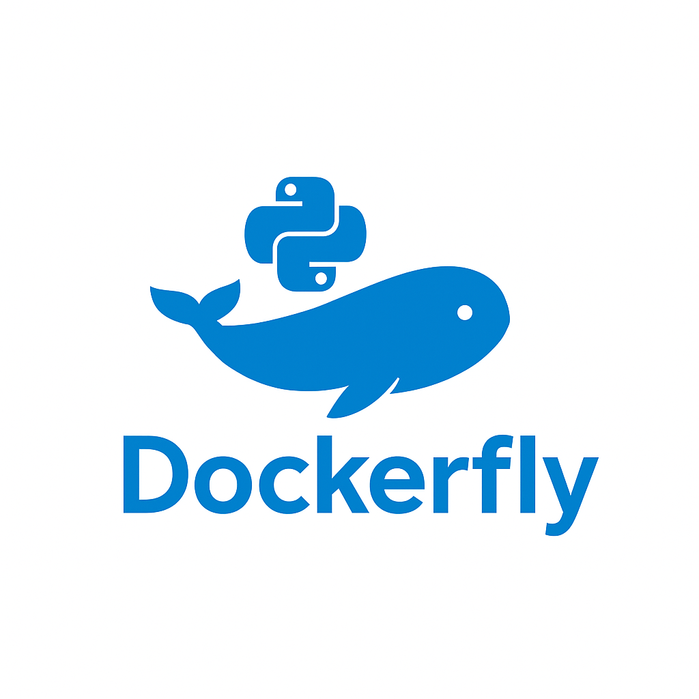

# DockerFly
This project proposes the creation of a tool to automate the deployment of Python applications. The goal is for a user to specify a project, so that the system receives it, processes it, and automatically launches it inside a container, without requiring any additional technical intervention.

